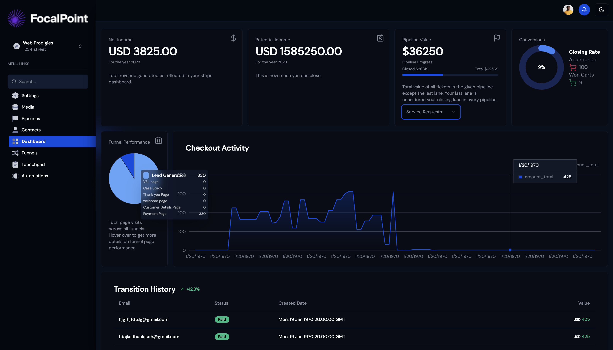

# DevQuest Portfolio 🚀

A modern, interactive portfolio website with developer quizzes, built with Next.js 15, TypeScript, and Appwrite. Features a playful Codedex-inspired design with vibrant colors and animations.



## ✨ Features

- 🎨 **Codedex-Inspired Design**: Playful, colorful UI with smooth animations
- 🔐 **Authentication**: Secure user authentication with Appwrite
- 🧠 **Interactive Quizzes**: Test your React.js and Next.js knowledge
- 🎯 **Skill Showcase**: Beautiful cards displaying technical expertise
- 📱 **Responsive Design**: Works seamlessly on all devices
- 🌙 **Dark Mode**: Eye-friendly dark theme
- ⚡ **Performance Optimized**: Built with Next.js 15 and App Router

## �️ Tech Stack

- **Framework**: Next.js 15
- **Language**: TypeScript
- **Styling**: Tailwind CSS
- **UI Components**: Radix UI + shadcn/ui
- **Authentication**: Appwrite
- **Icons**: Lucide React
- **Animations**: Framer Motion
- **State Management**: React Context API

## 🚀 Getting Started

### Prerequisites

- Node.js 18+ installed
- An Appwrite account (free at [appwrite.io](https://appwrite.io))

### Installation

1. **Clone the repository**
   ```bash
   git clone https://github.com/deepak9927/portfolio.git
   cd portfolio
   ```

2. **Install dependencies**
   ```bash
   npm install
   ```

3. **Set up Appwrite**
   
   a. Create a new project on [Appwrite Cloud](https://cloud.appwrite.io) or self-hosted instance
   
   b. Create a new database (optional, for future quiz persistence)
   
   c. Copy your project credentials

4. **Configure environment variables**
   
   Create a `.env.local` file in the root directory:
   ```env
   NEXT_PUBLIC_APPWRITE_ENDPOINT=https://cloud.appwrite.io/v1
   NEXT_PUBLIC_APPWRITE_PROJECT_ID=your_project_id_here
   
   # Optional: For quiz data persistence
   NEXT_PUBLIC_APPWRITE_DATABASE_ID=your_database_id
   NEXT_PUBLIC_APPWRITE_QUIZ_COLLECTION_ID=your_quiz_collection_id
   ```

5. **Run the development server**
   ```bash
   npm run dev
   ```

6. **Open your browser**
   
   Navigate to [http://localhost:3000](http://localhost:3000)

## 📁 Project Structure

```
portfolio/
├── src/
│   ├── app/
│   │   ├── layout.tsx          # Root layout with providers
│   │   ├── page.tsx            # Homepage
│   │   ├── global.css          # Global styles
│   │   ├── quiz/
│   │   │   └── page.tsx        # Quiz page
│   │   ├── sign-in/
│   │   │   └── [[...sign-in]]/
│   │   │       └── page.tsx    # Sign in page
│   │   └── sign-up/
│   │       └── [[...sign-up]]/
│   │           └── page.tsx    # Sign up page
│   ├── components/
│   │   ├── quiz/
│   │   │   └── Quiz.tsx        # Quiz component
│   │   └── ui/                 # shadcn/ui components
│   ├── contexts/
│   │   └── AuthContext.tsx     # Authentication context
│   ├── data/
│   │   └── quiz-data.ts        # Quiz questions data
│   └── lib/
│       ├── appwrite.ts         # Appwrite client config
│       ├── auth.ts             # Auth service
│       └── utils.ts            # Utility functions
├── public/
│   └── assets/                 # Images and assets
├── .env.local                  # Environment variables
├── next.config.js              # Next.js configuration
├── tailwind.config.ts          # Tailwind CSS configuration
└── package.json
```

## 🎮 Features Breakdown

### Authentication
- **Sign Up**: Create a new account with email and password
- **Sign In**: Secure login with email and password
- **Session Management**: Persistent authentication using Appwrite
- **Protected Routes**: Automatic redirect for unauthenticated users

### Quiz System
- **Two Categories**: React.js and Next.js quizzes
- **Multiple Difficulty Levels**: Beginner, Intermediate, and Advanced
- **Interactive UI**: Real-time feedback on answers
- **Score Tracking**: See your performance with percentage scores
- **Explanations**: Learn from detailed explanations for each question

### Design Features
- **Floating Icons Animation**: Background icons with physics-based movement
- **Gradient Cards**: Beautiful gradient backgrounds for skill cards
- **Blob Animations**: Smooth animated blobs in the background
- **Hover Effects**: Interactive hover states on all clickable elements
- **Responsive Layout**: Mobile-first design approach

## 🎨 Customization

### Adding More Quiz Questions

Edit `src/data/quiz-data.ts`:

```typescript
{
  id: 'unique-id',
  category: 'react', // or 'nextjs'
  difficulty: 'beginner', // or 'intermediate', 'advanced'
  question: 'Your question here?',
  options: ['Option 1', 'Option 2', 'Option 3', 'Option 4'],
  correctAnswer: 0, // Index of correct option (0-3)
  explanation: 'Explanation of the correct answer'
}
```

## 📝 Scripts

- `npm run dev` - Start development server
- `npm run build` - Build for production
- `npm run start` - Start production server
- `npm run lint` - Run ESLint

## 🚀 Deployment

### Deploy to Vercel (Recommended)

1. Push your code to GitHub
2. Import your repository on [Vercel](https://vercel.com)
3. Add environment variables in Vercel dashboard
4. Deploy!

## 🤝 Contributing

Contributions are welcome! Feel free to:
- Report bugs
- Suggest new features
- Submit pull requests

## 📄 License

This project is open source and available under the [MIT License](LICENSE).

## 👨‍💻 Author

**Deepak Thakur**
- GitHub: [@deepak9927](https://github.com/deepak9927)
- LinkedIn: [Deepak Thakur](https://www.linkedin.com/in/deepak-thakur-304b2a186)
- Email: deepakthakur9927@gmail.com

## 🙏 Acknowledgments

- Design inspired by [Codedex](https://www.codedex.io)
- UI components from [shadcn/ui](https://ui.shadcn.com)
- Authentication powered by [Appwrite](https://appwrite.io)
- Icons by [Lucide](https://lucide.dev)

---

Made with ❤️ and lots of ☕

- Hero section with floating tech icons
- Technical expertise showcase
- Detailed skill cards
- Contact information
- Professional links (GitHub, LinkedIn)

## 🔧 Customization

The portfolio can be easily customized by modifying:
- Color schemes in `globals.css`
- Content in `page.tsx`
- Skills and technologies in the skills array
- Contact information and social links

## 📄 License

This project is open source and available under the MIT License.

## 🤝 Contact

Feel free to reach out if you have any questions or would like to connect!